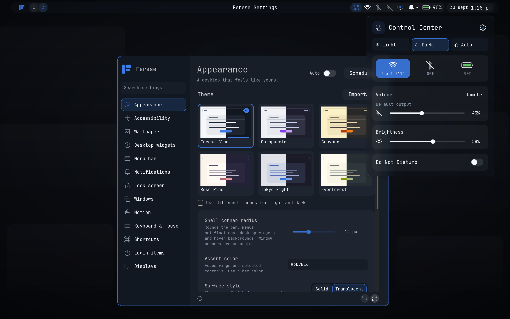

<p align="center">
  
</p>

<p align="center"><strong>A complete Wayland desktop built around personalization</strong></p>

<p align="center">
  <a href="docs/installation.md">Install</a> ·
  <a href="docs/configuration.md">Configure</a> ·
  <a href="docs/screenshots.md">Screenshots</a> ·
  <a href="docs/README.md">Documentation</a>
</p>

Ferese is a window manager and desktop shell built together and configured in one place, for people who want their desktop to be their own.



[View more screenshots](docs/screenshots.md)

## Features

- Arrange your windows in scrolling columns or tree layouts, keep some floating, and bring your workspaces together in overview
- Move around with keyboard shortcuts and touchpad gestures you can change to suit you
- Set up multiple monitors with fractional scaling
- Make the whole desktop your own with six theme families, Light/Dark/Auto modes, custom KDL themes, wallpapers, blur and adjustable corners
- Keep a clock and sticky notes on your desktop
- Capture and edit screenshots with Satty, share a window or display, and record from the top bar

## Install

Start with the [dependencies](docs/installation.md#requirements), then clone Ferese and
build it as your normal user:

```sh
git clone https://github.com/ferese-wm/ferese.git
cd ferese
./scripts/install.sh
```

Once it’s installed, log out and choose **Ferese** at your login screen, or run
`ferese-session` from a TTY or a greeter that accepts a command. The [installation
guide](docs/installation.md) also walks you through previews, updates and recovery.

## Configure

Make it yours through **Control Center → Settings** or `~/.config/ferese/config.kdl`,
with changes applying as you make them and the last working configuration staying in
place if an edit is invalid.

The [configuration reference](docs/configuration.md) and [example
config](packaging/config.kdl) cover everything from appearance and window layouts to
displays and startup apps.

## Default shortcuts

Use `Super`, usually the Windows key, to move around your desktop, and open **Settings →
Shortcuts** whenever you want to change a shortcut or gesture.

| Control | Action |
| --- | --- |
| Super + Enter | Open a terminal |
| Super + H / J / K / L | Focus left / down / up / right |
| Super + F | Maximize the window |
| Super + Shift + F | Toggle fullscreen |
| Super + R | Cycle column width |
| Super + Tab | Open overview |
| Super + M | Switch scrolling / tree layout |
| Print Screen | Capture the active monitor and open Satty |
| Super + Shift + S | Select a screenshot area |
| Super + Shift + E | Ask to log out |
| Super + left-button drag | Move a floating window |
| Super + right-button drag | Resize a floating window |
| Three-finger swipe up / down | Next / previous workspace |
| Three-finger swipe left / right | Focus the window to the right / left |

Explore [all shortcuts and mouse actions](docs/shortcuts.md) for more ways to arrange
your windows and move between workspaces.

## Documentation

The [documentation index](docs/README.md) brings the desktop guides together, while
[development instructions](docs/development.md) cover building, testing and
contributing.

Ferese is written in Rust using Smithay, with development happening [on
GitHub](https://github.com/ferese-wm/ferese). If something goes wrong, [open an
issue](https://github.com/ferese-wm/ferese/issues) with the steps to reproduce it and
any relevant logs.
