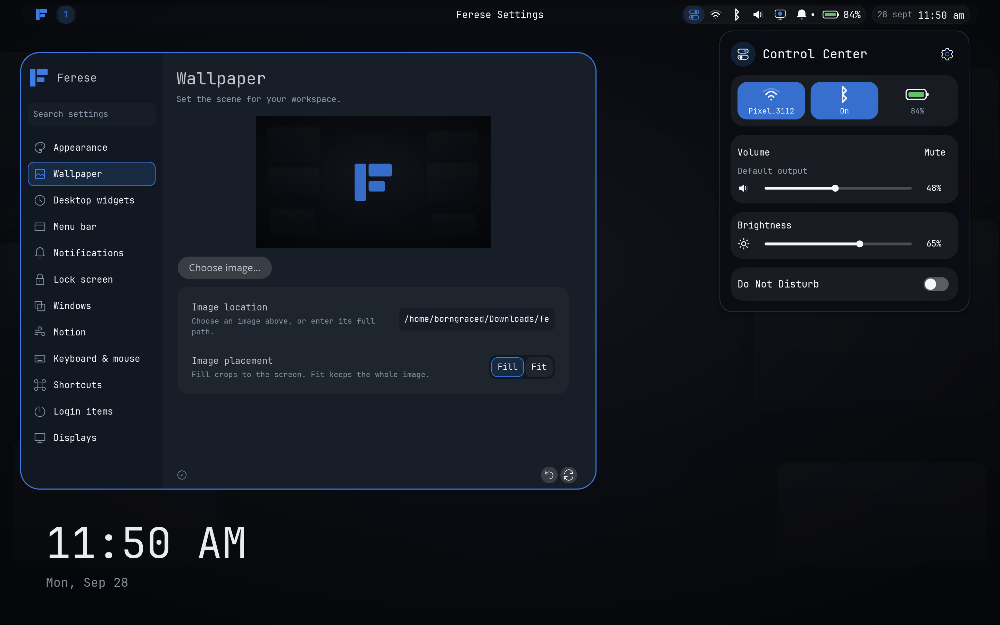
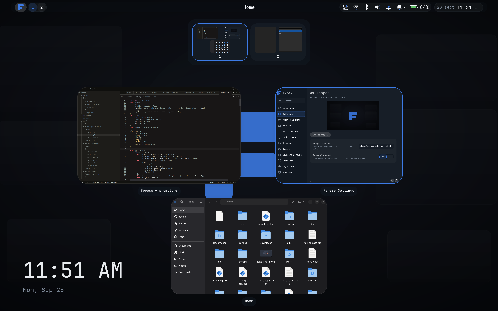
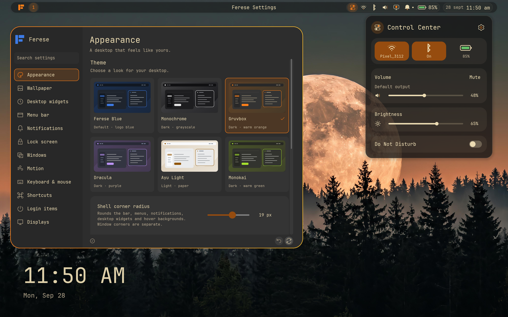

<p align="center">
  
</p>

<p align="center"><strong>A Wayland desktop with scrolling layouts and a shared theme.</strong></p>

<p align="center">
  <a href="docs/installation.md">Install</a> ·
  <a href="docs/configuration.md">Configure</a> ·
  <a href="docs/README.md">Documentation</a>
</p>

Ferese is a Linux desktop with scrolling columns, tree tiling, and floating
windows. It includes a top bar, Settings, notifications, desktop widgets, a
lock screen, and screen sharing. Change themes and settings without restarting.



## Features

- Scrolling and tree layouts, floating windows, and a workspace overview.
- Configurable keyboard shortcuts and touchpad gestures.
- Multiple monitors with fractional scaling.
- Six theme families, Light/Dark/Auto modes, custom KDL themes, wallpapers, blur, and adjustable corners.
- Clock and sticky-note widgets.
- Screenshots with Satty editing, screen sharing, and top-bar recording.



## Install

Install the [dependencies](docs/installation.md#requirements), then build as your
normal user:

```sh
git clone https://github.com/ferese-wm/ferese.git
cd ferese
./scripts/install.sh
```

Log out, select **Ferese** at your login screen, and sign in. For a TTY or a
greeter that accepts a command, run `ferese-session`.
See [Installation](docs/installation.md) for previews, updates, and recovery.

## Configure

Open **Control Center → Settings**, or edit `~/.config/ferese/config.kdl`.
Changes reload automatically; invalid edits keep the last working configuration.



See the [configuration reference](docs/configuration.md) and
[example config](packaging/config.kdl).

## Default shortcuts

`Super` is usually the Windows key. Change shortcuts and gestures in
**Settings → Shortcuts**.

| Control | Action |
| --- | --- |
| Super + Enter | Open a terminal |
| Super + H / J / K / L | Focus left / down / up / right |
| Super + F | Maximize the window |
| Super + Shift + F | Toggle fullscreen |
| Super + R | Cycle column width |
| Super + Tab | Open overview |
| Super + M | Switch scrolling / tree layout |
| Print Screen | Capture the active monitor and open Satty |
| Super + Shift + S | Select a screenshot area |
| Super + Shift + E | Ask to log out |
| Super + left-button drag | Move a floating window |
| Super + right-button drag | Resize a floating window |
| Three-finger swipe up / down | Next / previous workspace |
| Three-finger swipe left / right | Focus the window to the right / left |

See [all shortcuts and mouse actions](docs/shortcuts.md), including Super-drag
to move and Super-right-drag to resize floating windows.

## Documentation

Start with the [documentation index](docs/README.md) for user guides and
[development instructions](docs/development.md) for builds and testing.

Ferese is written in Rust using Smithay. Report bugs on
[GitHub](https://github.com/ferese-wm/ferese/issues) with reproduction steps and logs.
