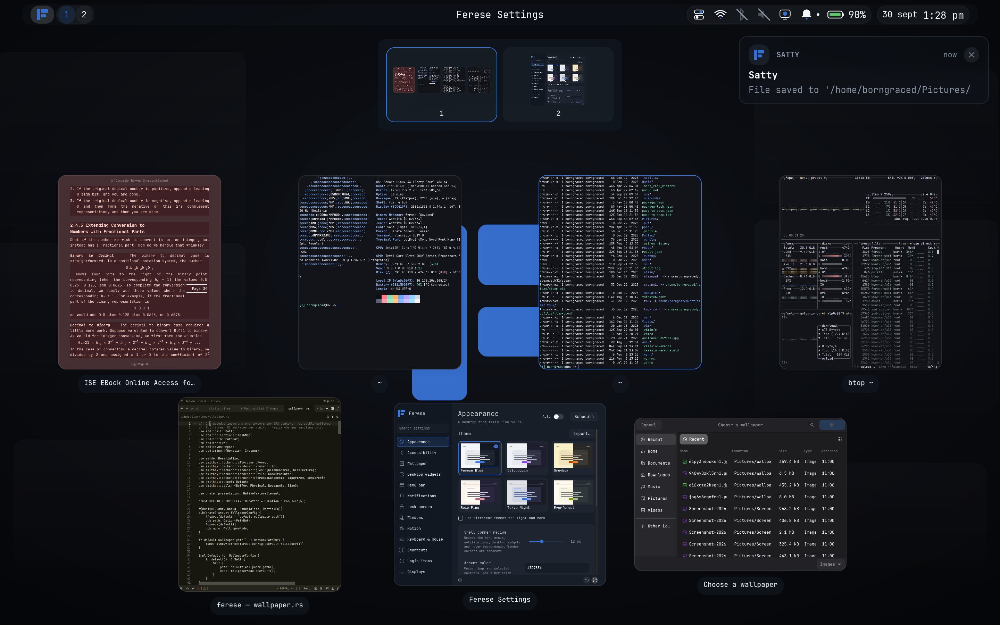
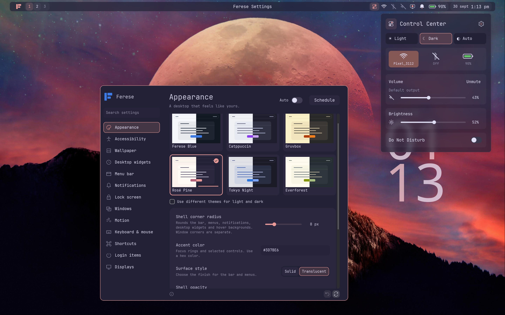

# Why Ferese

Most Wayland desktops are assembled from separate programs such as a compositor, a bar, a notification daemon, a launcher, a lock screen with each having its own config and its own idea of how things should look. Ferese is built as one desktop. Window management and the shell share a single configuration, so personalizing it means changing one thing, not five.

## Choose how windows fit

Scrolling columns let you keep windows at useful widths and move through them
horizontally. Tree tiling divides the screen into nested splits. Floating windows
work alongside either layout, and overview shows windows across workspaces.



## Change the desktop together

Choose a theme in Settings, then adjust the wallpaper, colors, font, corners,
and motion. Changes apply live. Window corners and shell corners can be set
independently.



For example, this changes shell corners:

```kdl
theme {
    geometry {
        shell-radius 16
    }
}
```

See [Configuration](configuration.md) for all options, or
[Installation](installation.md) to try Ferese in a nested preview.
